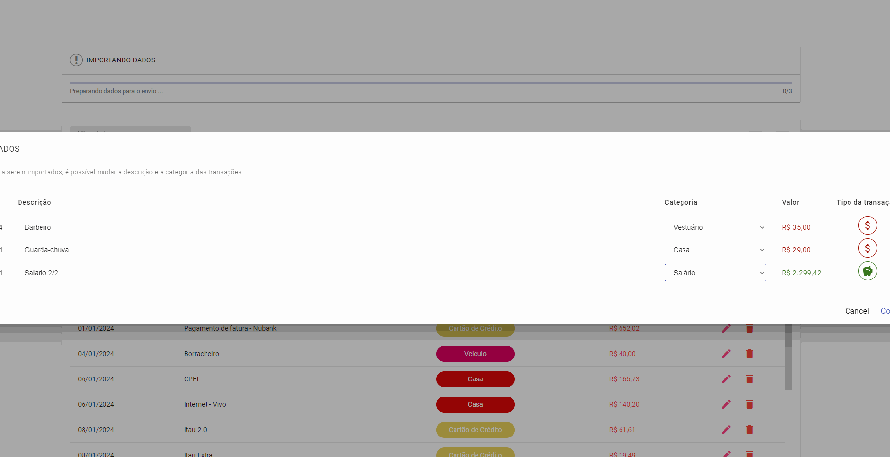

# Front-End - Gestor de gastos

Aplicação desenvolvida para gerir gastos pessoais e também colocar em prática novos conceitos obtidos de técnologia.

---

---

> Versão MVP do projeto (Ainda em desenvolvimento)

## Tecnologia utilizada

- Angular 17
- Consome dados a partir de API: [Gestor de gastos - Back-End](https://github.com/jcntck/controle-financeiro-backend)

## Módulos

- [x] Categorias
- [x] Transações de débitos
- [ ] Autenticação
- [ ] Dashboard
